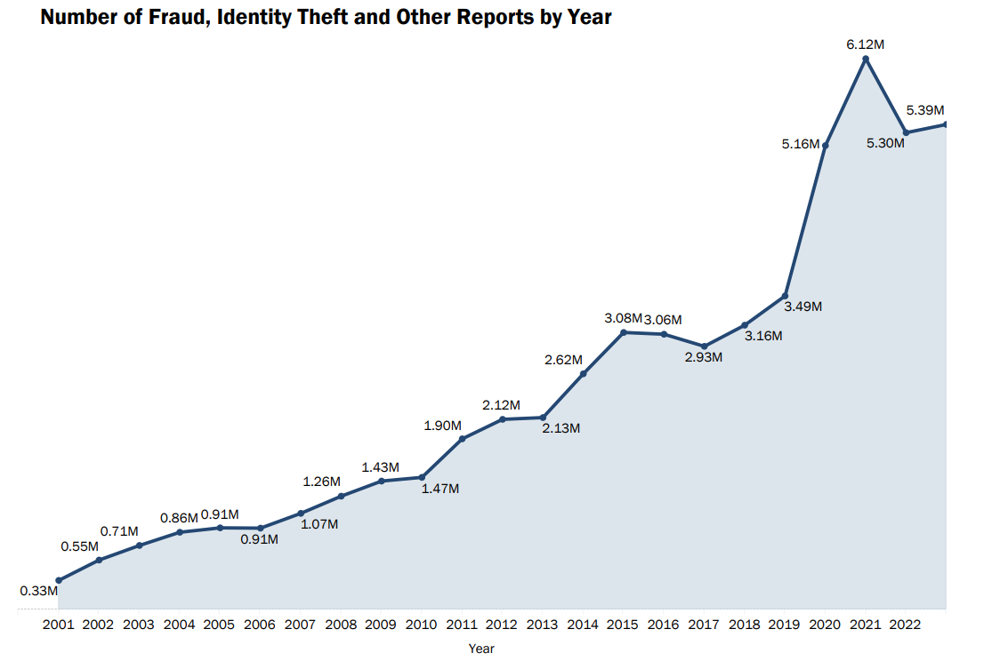

# Credit Card Fraud Analysis (On Going)

## Problem
A credit card is an electronic payment tool that uses a card issued by a bank or financial institution to make transactions. With this practical thing, customers can make an easy and immediate transaction. However, the problem lies on the transaction that not fully secured. However, these transactions are not completely safe. Based on the The Federal Trade Commision 2024 data, the fraud problem significantly rose by six million customers from 2001 to 2023 with the total loss of 10 billion USD.

<p align = "center">
  
</p>

## Objective
The objective of this project is:

- the amount of fraud transaction at the time
- How many transaction occured at that time
- How much amount of USD the fraudster get at the time
- create fraud detection using machine learning model
- To see the difference of machine learning performance and feature importances between imputation and oversampling method through Area Under Curve (AUC).

## Limitation
Limitation that exist in this project:

- Inadequate computing hardware makes this project time-consuming to execute on large amount dataset like credit card fraud, so not all open-source models are used.
- The data used was published in 2016. Moreover, this data comes from several bank samples in Belgium, so it is necessary to have the latest data and calibrate the model to obtain good detection accuracy.

## Data Description
The data published by Machine Learning Research Group University Libe de Bruxelles. Credit card dataset cannot be uploaded to Github due to large data size. This dataset can be downloaded in Kaggle platform. The dataset contains:

- Time: This feature represents time when the credit card transaction occured 
- the amount of transaction: represent the total transaction occured at that time
- Identity of the customer (V1 to V32): due to the protection regulation of the bank, the identity customer is turned into random numbers
- Class: A column that contains indications of fraud or not a transaction.

## Exploratory Data Analysis
This page explains about what is inside of the dataset.

### The Amount of the Transaction
This subsubpage contains the total of the occured transaction. The figure below shows the distribution data of the amount coloumn. 

<p align = "center">
  
</p>

- Based on the picture, the majority of the total transaction occured between 0 and 1000 USD, either fraud or not. The plot picture also means that the fraud transactions in that range are hard to be detected.

- Transactions made above this nominal amount are also often carried out with varying values.

<p align = "center">
  
</p>

- From the 50-hour recorded transaction, the amount of fraud one is less than ten thousand USD. 

- The maximum total transaction value obtained by the fraudster from this credit card incident was around 5000 USD in the 10th hour. The criminal received it at a busy time when many customers were doing transaction.

<p align = "center">
  
</p>

- The figure above illustrates the number of proceeding transactions recorded over a 48-hour period. Normal transactions that occur take place from morning to evening and occur periodically. Credit card fraud transaction occur most often at 11th and around 25th hour. The incident does not happen during the transaction.


### Class
The class feature contains 0 or 1 that represent the transactions are categorized non-fraud or fraud, respectively.

<p align = "center">
  
</p>

- The figure shows that the fraud transaction rarely occured. It less than 0.5% (about 490) of more than 250 thousands transanction in total.
- The difference in number between fraud and non-fraud is significant. The plot shows severe imbalace between those two categories of transaction.

### Customer Identity (V1-V32)

The V1 to V32 features represent the customer personal identity, such as name, address, sex, job, etc. which had been changed by PCA method due to the complexity of the dataset and bank protection regulation. The distribution of the sample, V1 - V4, can be seen in the image below.

<p align = "center">
  
</p>

- The sample of the customer identity, V1 to V4, data distribution shows a handful of them realized that their credit credit card had been fraud by criminal.

### Outlier and Skewness
Outliers are data points that have significant differences in value between the values ​​in the dataset. This anomaly can be seen by a boxplot.
- The plot illustrates the numerous outliers in the total purchases. There are various amount of transaction above the range of the most occured ones.

<p align = "center">
  
</p>

- If we look to the features other than the Amount

Skewness is a measure of how asymmetrical the data distribution is and is one way to determine the symmetry of the data distribution. If the mean, median, mode of data are in one single value, then the distribution of the feature is symmetric. There is one another way to measure the skewness or asymetrical data spread, by using Pearson first coefficient of skewness or Pearson second coefficient of skewness. The range of normal data distribution is between -1 and 1. 

<p align = "center">
  
</p>

- These features are beyond normal distribution score. Moreover, the Class, Amount, V8, and V28 are the most skewed data.

## Preprocessing Step
### Oversampling
The class feature has severe data imbalance that needs to be addressed by using oversampling method called Synthetic Minnority Oversampling Technique (SMOTE). The result of the technique can be seen in figure below. 

<p align = "center">
  
</p>
- The technique is used to overcome the severe imbalance issue by having the minority class compensate for the majority (oversampling).

### Handling Outlier
The outlier of data can be handled by using two methods, imputation or Isolation Forest. The result of those methods can we see in figure below.

<p align = "center">
  
</p>

- If Raw data distribution compared to the Isolation Forest, there is no significant alteration between them. However, the imputation method notably shifted the data. 

## Machine Learning Result
### Feature Selection
#### Imputation Version

The imputation method is used to eliminate outliers in the data by substitute them with random variables that are still included in the (Interquartile Range) IQR .

<p align = "center">
  
</p>

- Based on the figure above, there are four feature importances when using the decision tre model with imputation. The feature V17 and V10 are the highest score.

<p align = "center">
  
</p>

- The figure above shows the rank based on feature importances score by random forest model with imputation method. Ther are three features with the score above 0.1, V11, V17, dan V10.
- Based on those models,the V10 and V17 are two features that have importance scores that are always in the top 5. 

#### Isolation Forest Version

Isolation Forest is an unsupervised model used to detect data points that are considered anomalies (outliers). 

<p align = "center">
  
</p>

- Based on the image above, the V14 feature gets the highest score in terms of feature importances.

<p align = "center">
  

- Based on the Random Forest model, V4, V10, V14, and V17 are features with highest feature importance scores. 

- When the two models are compared, V14 is a mandatory feature to be included in the prediction model. 

### Model Performance

This project uses several open-sources such as XGBoost, Decision Tree, and Random Forest. Due to limited computational power, some models cannot be used to predict fraudulent of the credit card.

#### Raw data

The Performance using raw data (data without/before preprocessing) can be seen in the image below


<p align = "center">
  
</p>

- From the plot, we see the performance of decision tree and random forest model. They can predict more than 70000 of non fraud transaction and about 80 for otherwise.


| Machine Learning Model | Decision Tree | Random Forest |
| :--------------:| :------:| :------: |
| Accuracy        |   100 % | 100% |
| Recall          |   72 %  | 71% |
| F1 Score        |   100 % | 100% |
| Precision       |  100 %  | 100% |


- The machine learning models that utilize raw data can have 100 percent accuracy, tapi skor recall hanya 70 an persen. This is biased because the number of False Positive and False Negative, based on confusion matrix figure above, is more than zero. It means that the machine learning still fail to detect a handfull of credit card fraud. Futhremore, this bias accuracy is the result of severly imbalanced data.

## Conclusion
The conclusion of the research is

- The transaction mostly occured in range between 1 to 1000 USD. 
- The best model, based on the AUC metric, XGBoost can accurately predict the fraud.

## Futher Research

The research suggestion of this project:

- Try another machine learning model to predict the credit card fraud.
- Some preprocessing models, instead of SMOTE, may be potentially improve the machine learning performance.

## Reference

## Code

### Amount Feature Distribution Plot

```python
# Fraud-Not Fraud transaction
sns.set_style('whitegrid')
sns.histplot(data = df[df.Class == 1]['Amount'], bins = 30, kde = True, color = 'red', stat = 'density', alpha = 0.4, label = 'Fraud')
sns.histplot(data = df[df.Class == 0]['Amount'], bins = 30, kde = True, color = 'blue', stat = 'density', alpha = 0.2, label = 'Normal')
plt.title('The Amount of Fraud Transaction')
plt.legend()
#plt.savefig('The Amount of Fraud Transaction.png')
#files.download('The Amount of Fraud Transaction.png')
plt.show()
```


### Class Countplot

```python
# Countplot of Class
sns.countplot(data=df, x='Class')
plt.title('Countplot of Class')
plt.xticks([0,1], ['Not Fraud', 'Fraud'])
#plt.savefig('Countplot of CC Class.png')
#files.download('Countplot of CC Class.png')
plt.show()
```

### The 48-hour Period of Transaction (amount USD)

```python
# aggregate time
df['Hour'] = df['Time'].apply(lambda x: np.floor(x/3600))

tmp = df.groupby(['Hour','Class'])['Amount'].aggregate(['min', 'max', 'count', 'sum', 'mean', 'median', 'var']).reset_index()
df_tmp = pd.DataFrame(tmp)
df_tmp.columns = ['Hour', 'Class', 'Min', 'Max', 'Transaction', 'Sum', 'Mean', 'Median', 'Var']
df_tmp.head()

# create funtion of line plotting
def line_plotting(dataset = df_tmp, x_axis=None, y_axis=None, title = None):
  fig, axs = plt.subplots(ncols = 2, nrows = 1, figsize = (13,5), sharey = False)

  sns.lineplot(data = dataset.loc[dataset.Class == 0][[x_axis, y_axis]], x = x_axis, y = y_axis, ax = axs[0])
  sns.lineplot(data = dataset.loc[dataset.Class == 1][[x_axis, y_axis]], x = x_axis, y = y_axis, ax = axs[1], color = 'red')

  for ax in axs:
    ax.yaxis.set_major_formatter(mticker.ScalarFormatter())
    ax.yaxis.get_major_formatter().set_scientific (False)
    ax.yaxis.get_major_formatter().set_useOffset(False)

    ax.tick_params(axis = 'x', labelsize = 12)
    ax.tick_params(axis = 'y', labelsize = 12)

  plt.suptitle('The 48-hour Period of Transaction (in terms of {})'.format(title), fontsize = 14)
  fig.set_facecolor('#a0cdf8')
  axs[0].set_title('Normal Transaction', fontsize = 14)
  axs[1].set_title('Fraud Transaction', fontsize = 14)
  axs[0].set_xlabel('Hour', fontsize = 14)
  axs[1].set_xlabel('Hour', fontsize = 14)
  axs[0].set_ylabel(y_axis, fontsize = 14)
  axs[1].set_ylabel(y_axis, fontsize = 14)
  fig.tight_layout()

  #plt.savefig('Plot of {} Transaction.png'.format(y_axis), dpi = 300)
  #files.download('Plot of {} Transaction.png'.format(y_axis))
  return plt.show()
```

### Customer Identity Plot Distribution

```python

```

### Skewness Score Barplot

```python

```

### Outlier Countplot 
```python

```

### Isolation Forest (Handle Anomaly)

```python

```