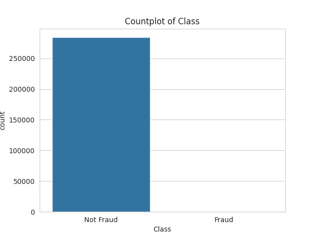

# Credit Card Fraud Analysis

## Problem
A credit card is an electronic payment tool that uses a card issued by a bank or financial institution to make transactions. With this practical thing, customers can make an easy and immediate transaction. However, the problem lies on the transaction that not fully secured. However, these transactions are not completely safe. Based on the The Federal Trade Commision 2024 data, the fraud problem significantly rose by six million customers from 2001 to 2023 with the total loss of 10 billion USD.

## Objective
The objective of this project is:

- the amount of fraud transaction
- create fraud detection using machine learning model

## Data Description
The data published by Machine Learning Research Group University Libe de Bruxelles. The dataset contains:

- Time: This feature represents time when the credit card transaction occured 
- the amount of transaction: represent the total transaction occured at that time
- Identity of the customer (V1 to V32): due to the protection regulation of the bank, the identity customer is turned into random numbers
- Class: A column that contains indications of fraud or not a transaction.

## Exploratory Data Analysis
This page explains about what is inside of the dataset.

### The Amount of the Transaction
This subsubpage contains the total of the occured transaction. The figure below shows the distribution data of the amount coloumn. Based on the picture, the majority of the total transaction occured between 0 and 1000 USD, either fraud or not. The plot picture also means that the fraud transactions in that range are hard to be detected.

### Class
The class feature contains 0 or 1 that represent the transactions are categorized non-fraud or fraud, respectively.

### Outlier and Skewness
Outliers are data points that have significant differences in value between the values ​​in the dataset. The figure below represented the amount column. 

Skewness is a measure of how asymmetrical the data distribution is and is one way to determine the symmetry of the data distribution. The figure........

## Preprocessing Step
The class feature has severe data imbalance that needs to be addressed by using oversampling method. The figure below shows before and after the method implemented.

## Machine Learning Result
This page dedicated to explain the machine learning metrics result. 

## Conclusion
The conclusion of the research is.......

## Futher Research
